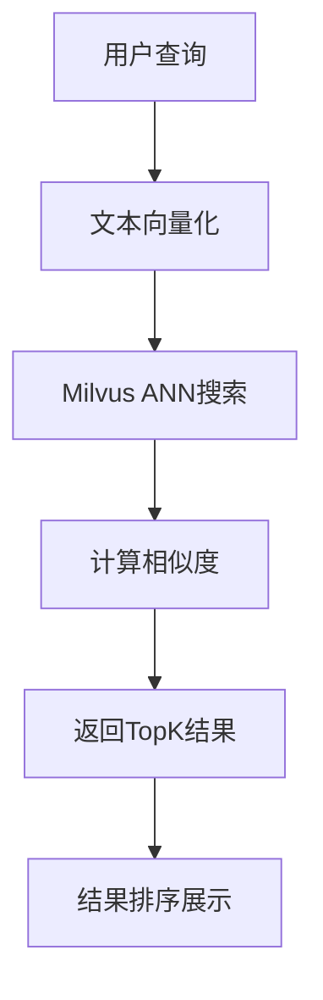

# 🔥 小红书爆文向量知识库使用指南

## 📖 概述

本系统在原有知识库管理基础上，集成了专门用于小红书数据的向量数据库功能，支持爆文内容的智能检索和相似度分析。

## 🚀 核心特性

### ✨ 技术栈
- **向量数据库**: Milvus (本地Docker + 阿里云)
- **SDK**: Node.js SDK (`@zilliz/milvus2-sdk-node@2.6.0`)
- **搜索算法**: ANN (Approximate Nearest Neighbor) 搜索
- **向量化模型**: OpenAI text-embedding-ada-002 (1536维)
- **相似度计算**: 内积相似度 (IP)

### 🎯 功能特色
1. **多格式数据导入**: 支持 JSON 和 CSV 格式
2. **智能向量化**: 自动将标题和内容转换为向量表示
3. **ANN 相似度搜索**: 基于语义而非关键词的智能搜索
4. **RAG 召回测试**: 检索增强生成测试功能
5. **实时统计**: 数据量统计和性能监控

## 📋 数据结构

### 支持的字段
```json
{
  "title": "标题",
  "content": "内容", 
  "audio_url": "音频链接",
  "cover_image_url": "封面图片链接",
  "video_url": "视频链接",
  "likes": 点赞数,
  "favorites": 收藏数,
  "comments": 评论数,
  "author": "作者",
  "tags": ["标签1", "标签2"],
  "publish_time": "发布时间"
}
```

### 向量存储结构
```
Milvus Collection: lab_xiaohongshu_posts
├── id (主键)
├── title_vector (标题向量, 1536维)
├── content_vector (内容向量, 存储在metadata中)
├── text (合并搜索文本)
├── source ("xiaohongshu")
└── metadata (JSON格式完整数据)
```

## 🛠️ 使用方法

### 第一步：初始化系统

1. **访问知识库管理页面**
   ```
   http://localhost:3000/knowledge-base
   ```

2. **点击"🔥 爆文向量库"选项卡**

3. **初始化爆文库**
   - 点击"初始化爆文库"按钮
   - 系统会自动创建 Milvus 集合和索引

### 第二步：导入数据

#### JSON 格式导入
```json
[
  {
    "title": "超简单芝士蛋糕教程",
    "content": "今天分享一个零失败的芝士蛋糕制作方法，只需要5个步骤...",
    "video_url": "https://example.com/video1.mp4",
    "likes": 1250,
    "favorites": 380,
    "comments": 156,
    "author": "美食达人小王",
    "tags": ["美食", "烘焙", "甜品"]
  },
  {
    "title": "三亚旅游攻略",
    "content": "分享我的三亚5日游完整攻略，包含住宿、美食、景点推荐...",
    "cover_image_url": "https://example.com/cover1.jpg",
    "likes": 2100,
    "favorites": 890,
    "comments": 234
  }
]
```

#### CSV 格式导入
```csv
title,content,video_url,likes,favorites,comments,author,tags
超简单芝士蛋糕教程,今天分享一个零失败的芝士蛋糕制作方法,https://example.com/video1.mp4,1250,380,156,美食达人小王,美食;烘焙;甜品
三亚旅游攻略,分享我的三亚5日游完整攻略,https://example.com/cover1.jpg,2100,890,234,旅游博主,旅游;三亚;攻略
```

### 第三步：ANN 相似度搜索

1. **在搜索框输入查询内容**
   - 例如："美食制作"、"旅游攻略"、"护肤心得"

2. **系统会自动返回最相似的内容**
   - 显示相似度百分比
   - 展示点赞、收藏、评论数据
   - 支持内容预览

### 第四步：RAG 召回测试

1. **切换到"RAG 召回测试"选项卡**

2. **选择集合**: `lab_xiaohongshu_posts`

3. **输入测试问题**
   - 例如："如何制作好吃的甜品？"
   - 例如："三亚有什么好玩的地方？"

4. **查看召回结果和相似度评分**

## 🔧 技术实现细节

### 向量化过程


### 搜索流程


### API 架构
```
/api/xiaohongshu-init    - 集合初始化
/api/xiaohongshu-import  - 数据导入
/api/xiaohongshu-search  - ANN搜索
```

## ⚙️ 配置说明

### 环境变量 (.env.local)
```env
# Milvus 配置
MILVUS_ENDPOINT=http://localhost:19530
MILVUS_USERNAME=root
MILVUS_PASSWORD=Milvus

# OpenAI 配置 (用于真实向量化)
OPENAI_API_KEY=your-api-key
OPENAI_BASE_URL=https://api.openai.com/v1
```

### 性能参数
- **向量维度**: 1536 (OpenAI标准)
- **索引类型**: IVF_FLAT
- **相似度度量**: 内积 (IP)
- **搜索参数**: nprobe=10
- **批处理大小**: 1000条/批

## 📊 使用场景

### 1. 内容推荐
```javascript
// 基于用户兴趣推荐相似内容
const results = await searchSimilarContent(
  'lab_xiaohongshu_posts',
  '用户感兴趣的话题',
  'both',
  10,
  0.5
)
```

### 2. 重复内容检测
```javascript
// 检测是否存在相似内容
const duplicates = await searchSimilarContent(
  'lab_xiaohongshu_posts', 
  newPostContent,
  'content',
  5,
  0.8
)
```

### 3. 热点话题分析
```javascript
// 分析热门话题的相关内容
const trendingContent = await searchSimilarContent(
  'lab_xiaohongshu_posts',
  '当前热点话题',
  'both',
  20,
  0.4
)
```

## 🎨 界面功能

### 主要组件
- **数据导入区域**: 支持JSON/CSV格式切换
- **ANN搜索区域**: 实时相似度搜索
- **结果展示区域**: 美观的卡片式布局
- **统计信息区域**: 数据量和性能指标

### 交互特性
- **拖拽上传**: 支持文件拖拽导入
- **实时搜索**: 输入即搜索
- **响应式设计**: 适配不同屏幕尺寸
- **加载状态**: 优雅的加载动画

## 🚨 注意事项

### 数据质量
1. **确保数据完整性**: title 和 content 字段不能为空
2. **控制数据量**: 建议单次导入不超过1000条
3. **字段映射**: CSV中的中文字段名会自动映射

### 性能优化
1. **批量处理**: 大量数据分批导入
2. **索引预热**: 首次搜索可能较慢
3. **内存管理**: 定期监控Milvus内存使用

### 安全考虑
1. **API访问控制**: 生产环境需要添加认证
2. **数据加密**: 敏感信息建议加密存储
3. **权限管理**: 按角色控制操作权限

## 🔍 故障排除

### 常见问题

1. **连接失败**
   ```bash
   # 检查Milvus服务状态
   docker ps | grep milvus
   
   # 检查端口是否开放
   netstat -an | grep 19530
   ```

2. **向量化失败**
   ```bash
   # 检查OpenAI API配置
   echo $OPENAI_API_KEY
   
   # 使用模拟向量(开发测试)
   unset OPENAI_API_KEY
   ```

3. **搜索无结果**
   - 检查集合是否初始化
   - 确认数据是否成功导入
   - 降低相似度阈值 (minScore)

### 日志查看
```bash
# 查看应用日志
npm run dev

# 查看Milvus日志
docker logs milvus-standalone
```

## 🎯 扩展功能

### 计划中的功能
- [ ] 多模态搜索 (图片+文本)
- [ ] 智能标签自动生成
- [ ] 内容质量评分
- [ ] 趋势分析图表
- [ ] 数据导出功能

### 自定义开发
1. **添加新字段**: 修改 `XiaohongshuPost` 接口
2. **自定义向量化**: 替换 `generateEmbedding` 方法
3. **扩展搜索逻辑**: 修改 `searchSimilarPosts` 函数

---

## 📞 技术支持

如有问题请参考：
- [Milvus官方文档](https://milvus.io/docs/zh)
- [Node.js SDK文档](https://milvus.io/docs/zh/install-node.md)
- 项目README.md文档

**祝你使用愉快！** 🎉
