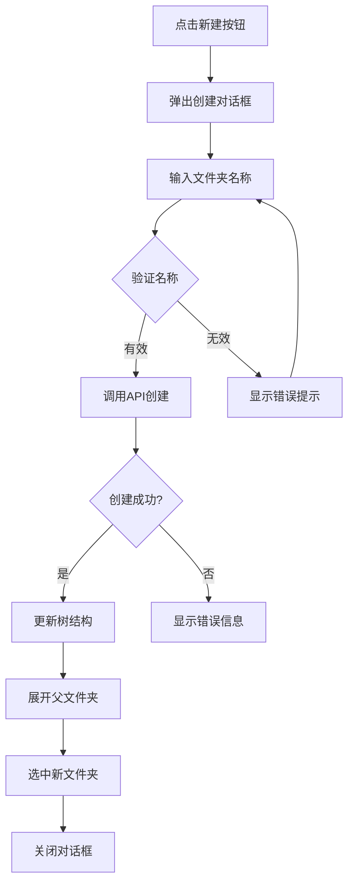
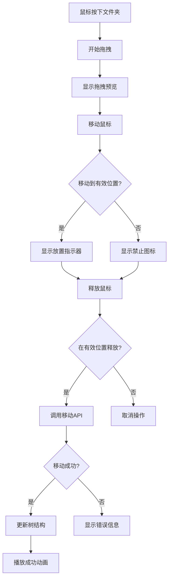
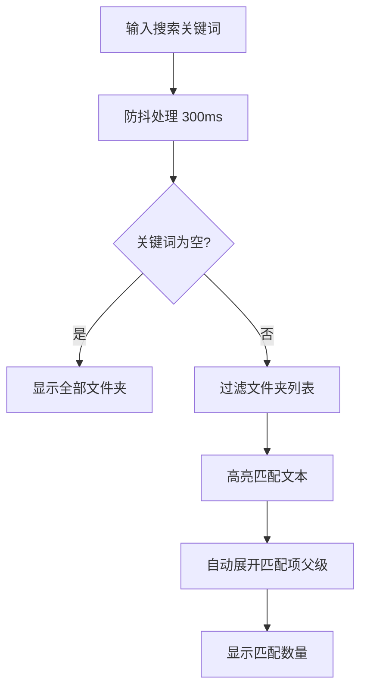

# 备忘录文件夹管理功能 PRD

## 1. 功能概述

### 1.1 核心目标
实现备忘录的文件夹树形结构管理，支持无限层级嵌套的文件夹系统，为后续备忘录内容管理提供组织架构基础。

### 1.2 功能边界
- ✅ 文件夹的增删查改
- ✅ 拖拽排序和层级调整
- ✅ 文件夹重命名
- ✅ 文件夹展开/折叠状态管理
- ❌ 备忘录内容管理（后续版本）
- ❌ 文件夹权限管理（使用用户级隔离）

### 1.3 设计理念：模块化与可维护性
本功能采用**模块化设计思想**，保持代码结构清晰和可维护性：

- **🔧 模块化设计**: 文件夹操作逻辑独立封装，便于维护和测试
- **🔌 标准化接口**: 提供一致的文件夹CRUD操作API
- **📦 代码复用**: 核心工具类和权限控制逻辑可在项目内复用
- **🎯 专注当前**: 当前专门为备忘录场景设计，确保功能完善和用户体验

## 2. 数据模型设计

### 2.1 现有表结构分析
```sql
-- book_folds 表（已存在）
CREATE TABLE book_folds (
    id UUID PRIMARY KEY DEFAULT uuid_generate_v4(),
    user_id UUID NOT NULL,                    -- 用户隔离
    fold_structure JSONB NOT NULL DEFAULT '[]'::jsonb,  -- 文件夹树结构
    type TEXT,                                -- 业务类型标识
    created_at TIMESTAMPTZ NOT NULL DEFAULT now(),
    updated_at TIMESTAMPTZ NOT NULL DEFAULT now()
);

-- 索引（已存在）
CREATE INDEX idx_book_folds_user_id ON book_folds(user_id);
CREATE INDEX idx_book_folds_structure_gin ON book_folds USING gin(fold_structure);
```

### 2.2 数据结构定义
```typescript
// 文件夹节点结构
interface FolderNode {
  fold_id: string;           // 文件夹唯一ID (UUID)
  fold_name: string;         // 文件夹名称
  children: FolderNode[];    // 子文件夹数组
  expanded?: boolean;        // 前端状态：是否展开
  level?: number;           // 前端计算：层级深度
}

// 数据库记录结构
interface BookFold {
  id: string;                     // 记录ID
  user_id: string;               // 用户ID
  fold_structure: FolderNode[];  // 文件夹树结构
  type: string | null;           // 业务类型（当前可为空）
  created_at: string;
  updated_at: string;
}
```

### 2.3 业务规则
- 每个用户拥有独立的文件夹树
- type 字段当前可为空（保留字段，后续业务扩展使用）
- fold_structure 存储完整的树形结构
- 文件夹名称长度限制：1-50字符
- 最大嵌套层级：10层
- 同级文件夹名称不能重复

## 3. API 接口设计

### 3.1 基础配置
- **Base URL**: `/api/memo-folders`
- **认证方式**: 用户ID参数传递（与自定义字段系统一致）
- **数据格式**: JSON

### 3.2 用户身份识别
所有API接口通过请求参数或请求体中的用户信息进行身份识别：

| 参数 | 类型 | 传递方式 | 必填 | 说明 |
|------|------|----------|------|------|
| `userId` | string (UUID) | 查询参数/请求体 | ✅ | 用户唯一标识符 |
| `fold_id` | string (UUID) | 查询参数/请求体 | 视情况 | 文件夹唯一标识符 |

#### 项目权限设计背景
- **系统特性**: 在此平台登录的用户即默认为管理员身份
- **管理员UUID**: `00000000-0000-4000-8000-000000000001`
- **前端默认行为**: 前端默认传递管理员UUID给后端接口
- **权限统一性**: 与"自定义字段"系统共用一套权限控制逻辑

#### 权限控制
- **管理员权限**（默认）: 
  - 管理员（userId=`00000000-0000-4000-8000-000000000001`）可以查看和操作所有用户的文件夹
  - 可以为任何用户创建、修改、删除文件夹
  - GET请求返回所有用户的文件夹（按用户分组）
- **普通用户权限**（保留支持）: 
  - 基于userId进行数据隔离，只能访问自己创建的文件夹
  - 对自己的文件夹拥有完全权限（增删改查）
- **权限验证**: 后端通过统一的权限验证逻辑进行控制
- **系统统一性**: 建议将"自定义字段"系统的权限控制逻辑修改为与本系统一致

### 3.3 获取文件夹树
```http
GET /api/memo-folders?userId={userId}
```

**查询参数：**
| 参数 | 类型 | 必填 | 说明 |
|------|------|------|------|
| `userId` | string | ✅ | 用户ID (UUID)，用于数据隔离 |

**响应：**
```json
{
  "success": true,
  "data": {
    "folders": [
      {
        "fold_id": "c6a9a6c2-4a11-4d3e-8c4d-2a1b7e6c9b3a",
        "fold_name": "工作备忘",
        "children": [
          {
            "fold_id": "8f3b2e5a-7c1d-4b8f-9e3a-6c1d8f3b2e5a",
            "fold_name": "项目A",
            "children": []
          }
        ]
      }
    ]
  }
}
```

### 3.4 创建文件夹
```http
POST /api/memo-folders
```
**请求体：**
```json
{
  "userId": "123e4567-e89b-12d3-a456-426614174000",
  "fold_name": "新文件夹",
  "parent_id": "c6a9a6c2-4a11-4d3e-8c4d-2a1b7e6c9b3a",
  "position": 0
}
```

**字段说明：**
| 字段 | 类型 | 必填 | 说明 |
|------|------|------|------|
| `userId` | string | ✅ | 用户ID (UUID)，用于权限验证 |
| `fold_name` | string | ✅ | 文件夹名称（1-50字符） |
| `parent_id` | string | 否 | 父文件夹ID，null表示根级别 |
| `position` | number | 否 | 在同级中的位置索引，默认0 |

### 3.5 重命名文件夹
```http
PUT /api/memo-folders
```
**请求体：**
```json
{
  "userId": "123e4567-e89b-12d3-a456-426614174000",
  "fold_id": "c6a9a6c2-4a11-4d3e-8c4d-2a1b7e6c9b3a",
  "action": "rename",
  "fold_name": "重命名后的文件夹"
}
```

**字段说明：**
| 字段 | 类型 | 必填 | 说明 |
|------|------|------|------|
| `userId` | string | ✅ | 用户ID (UUID)，用于权限验证 |
| `fold_id` | string | ✅ | 文件夹唯一标识符 (UUID) |
| `action` | string | ✅ | 操作类型：`rename` |
| `fold_name` | string | ✅ | 新的文件夹名称 |

### 3.6 移动文件夹
```http
PUT /api/memo-folders
```
**请求体：**
```json
{
  "userId": "123e4567-e89b-12d3-a456-426614174000",
  "fold_id": "c6a9a6c2-4a11-4d3e-8c4d-2a1b7e6c9b3a",
  "action": "move",
  "new_parent_id": "target-parent-id",
  "position": 2
}
```

**字段说明：**
| 字段 | 类型 | 必填 | 说明 |
|------|------|------|------|
| `userId` | string | ✅ | 用户ID (UUID)，用于权限验证 |
| `fold_id` | string | ✅ | 文件夹唯一标识符 (UUID) |
| `action` | string | ✅ | 操作类型：`move` |
| `new_parent_id` | string | 否 | 目标父文件夹ID，null表示移动到根级别 |
| `position` | number | 否 | 在目标位置的索引，默认0 |

### 3.7 删除文件夹
```http
DELETE /api/memo-folders
```
**请求体：**
```json
{
  "userId": "123e4567-e89b-12d3-a456-426614174000",
  "fold_id": "c6a9a6c2-4a11-4d3e-8c4d-2a1b7e6c9b3a"
}
```

**字段说明：**
| 字段 | 类型 | 必填 | 说明 |
|------|------|------|------|
| `userId` | string | ✅ | 用户ID (UUID)，用于权限验证 |
| `fold_id` | string | ✅ | 文件夹唯一标识符 (UUID) |

**特殊处理：**
- 删除文件夹时递归删除所有子文件夹
- 返回受影响的文件夹ID列表用于前端状态更新

### 3.8 批量更新结构
```http
PUT /api/memo-folders
```
**请求体：**
```json
{
  "userId": "123e4567-e89b-12d3-a456-426614174000",
  "action": "batch-update",
  "fold_structure": [
    {
      "fold_id": "c6a9a6c2-4a11-4d3e-8c4d-2a1b7e6c9b3a",
      "fold_name": "工作备忘",
      "children": []
    }
  ]
}
```

**字段说明：**
| 字段 | 类型 | 必填 | 说明 |
|------|------|------|------|
| `userId` | string | ✅ | 用户ID (UUID)，用于权限验证 |
| `action` | string | ✅ | 操作类型：`batch-update` |
| `fold_structure` | array | ✅ | 完整的新文件夹树结构 |

## 4. 前端页面设计

### 4.1 页面整体布局

#### 4.1.1 页面路由
- **路径**: `/memo-folders`
- **页面标题**: "备忘录文件夹管理"
- **面包屑**: 首页 > 备忘录文件夹管理

#### 4.1.2 页面布局结构
```
┌─────────────────────────────────────────────────────────────────┐
│ Header: 备忘录文件夹管理 + 工具栏                                 │
├─────────────────────────────────────────────────────────────────┤
│ Toolbar: 搜索框 + 新建按钮 + 批量操作按钮 + 视图切换            │
├─────────────────────────────────────────────────────────────────┤
│                                                                 │
│  ┌─────────────────────┐  ┌─────────────────────────────────────┐ │
│  │                     │  │                                     │ │
│  │   文件夹树视图       │  │         内容预览区                   │ │
│  │   (左侧面板)        │  │        (右侧面板)                   │ │
│  │                     │  │                                     │ │
│  │   - 文件夹树        │  │   - 选中文件夹信息                  │ │
│  │   - 展开/折叠       │  │   - 备忘录数量统计                  │ │
│  │   - 拖拽排序        │  │   - 最近更新时间                    │ │
│  │   - 右键菜单        │  │   - 快速操作按钮                    │ │
│  │                     │  │                                     │ │
│  └─────────────────────┘  └─────────────────────────────────────┘ │
│                                                                 │
├─────────────────────────────────────────────────────────────────┤
│ Footer: 统计信息 + 状态提示                                      │
└─────────────────────────────────────────────────────────────────┘
```

#### 4.1.3 布局规格
| 视口宽度 | 布局方案 | 文件夹树宽度 | 内容预览区 |
|---------|----------|-------------|-----------|
| ≥1200px | 双栏布局 | 320px（固定） | 自适应剩余宽度 |
| 1024-1199px | 双栏布局 | 280px（固定） | 自适应剩余宽度 |
| <1024px | 最小支持 | 260px（固定） | 最小600px |

**桌面端设计要求**：
- 最小视口宽度：1024px（推荐1200px及以上）
- 专为桌面端Web应用设计
- 不考虑移动端适配
- 支持鼠标交互操作（拖拽、右键菜单、悬停效果）
- 支持键盘快捷键操作

### 4.2 组件层次结构
```
MemoFoldersManagement (页面容器)
├── PageHeader (页面头部)
│   ├── PageTitle (页面标题)
│   └── HelpButton (帮助按钮)
├── Toolbar (工具栏)
│   ├── SearchBox (搜索框)
│   ├── CreateFolderButton (新建文件夹按钮)
│   ├── BatchActions (批量操作)
│   └── ViewToggle (视图切换)
├── MainContent (主内容区)
│   ├── LeftPanel (左侧面板)
│   │   ├── FolderTreeView (文件夹树)
│   │   │   ├── FolderNode (文件夹节点)
│   │   │   │   ├── FolderIcon (文件夹图标)
│   │   │   │   ├── FolderName (文件夹名称)
│   │   │   │   ├── FolderActions (操作按钮)
│   │   │   │   └── ContextMenu (右键菜单)
│   │   │   └── EmptyState (空状态)
│   │   └── TreeFooter (树底部统计)
│   └── RightPanel (右侧面板)
│       ├── FolderDetails (文件夹详情)
│       ├── QuickStats (快速统计)
│       └── QuickActions (快速操作)
├── Modals (模态框组件)
│   ├── CreateFolderModal (创建文件夹)
│   ├── RenameFolderModal (重命名文件夹)
│   ├── DeleteConfirmModal (删除确认)
│   └── BatchOperationModal (批量操作)
└── StatusBar (状态栏)
```

### 4.3 详细UI组件设计

#### 4.3.1 PageHeader 组件
```typescript
interface PageHeaderProps {
  title: string;
  showHelp?: boolean;
  onHelpClick?: () => void;
}
```

**视觉设计**：
- 高度：64px
- 背景：渐变色 (primary.500 → purple.500)
- 标题：24px，白色，左对齐
- 帮助按钮：右上角，图标按钮

#### 4.3.2 Toolbar 组件
```typescript
interface ToolbarProps {
  searchValue: string;
  onSearchChange: (value: string) => void;
  selectedCount: number;
  viewMode: 'tree' | 'list';  // 桌面端支持树形/列表视图切换
  onViewModeChange: (mode: 'tree' | 'list') => void;
  onCreateFolder: () => void;
  onBatchDelete: () => void;
}
```

**布局设计**：
```
┌─────────────────────────────────────────────────────────────────┐
│ 🔍 搜索框                    [新建文件夹] [批量删除] [视图切换]     │
└─────────────────────────────────────────────────────────────────┘
```

**组件样式**：
- 高度：56px
- 背景：白色/深色主题适配
- 阴影：subtle
- 内边距：16px

#### 4.3.3 FolderTreeView 组件
```typescript
interface FolderTreeViewProps {
  folders: FolderNode[];
  loading: boolean;
  selectedId?: string;
  expandedIds: Set<string>;
  editingId?: string;
  searchTerm?: string;
  onSelect: (folderId: string) => void;
  onExpand: (folderId: string) => void;
  onCreate: (parentId?: string) => void;
  onRename: (folderId: string, newName: string) => void;
  onMove: (folderId: string, targetId: string, position: number) => void;
  onDelete: (folderId: string) => void;
}
```

**交互设计（桌面端优化）**：
- 虚拟化滚动：支持1000+文件夹的流畅滚动
- 拖拽指示器：蓝色高亮线条，鼠标操作优化
- 层级缩进：每级16px，清晰的层次结构
- 展开/折叠动画：200ms ease-in-out
- 悬停效果：鼠标悬停显示操作按钮
- 右键菜单：桌面端标准右键交互

#### 4.3.4 FolderNode 组件
```typescript
interface FolderNodeProps {
  folder: FolderNode;
  level: number;
  isSelected: boolean;
  isExpanded: boolean;
  isEditing: boolean;
  isDragging: boolean;
  canDrop: boolean;
  children?: React.ReactNode;
  onSelect: () => void;
  onToggleExpand: () => void;
  onStartEdit: () => void;
  onEndEdit: (newName: string) => void;
  onDelete: () => void;
  onDragStart: () => void;
  onDragEnd: () => void;
  onDrop: (position: 'before' | 'after' | 'inside') => void;
}
```

**状态设计**：
| 状态 | 视觉效果 | 交互行为 |
|------|----------|----------|
| 默认 | 灰色背景，图标正常 | 悬停显示操作按钮 |
| 选中 | 蓝色背景，白色文字 | 高亮显示 |
| 悬停 | 浅灰背景，操作按钮出现 | Hover效果 |
| 编辑 | 输入框模式，聚焦状态 | 全选文本 |
| 拖拽中 | 半透明，拖拽预览 | 跟随鼠标 |
| 拖拽目标 | 蓝色边框，高亮背景 | 可放置提示 |

#### 4.3.5 ContextMenu 组件
```typescript
interface ContextMenuProps {
  x: number;
  y: number;
  visible: boolean;
  canEdit: boolean;
  canDelete: boolean;
  onClose: () => void;
  onRename: () => void;
  onDelete: () => void;
  onCreateChild: () => void;
  onCopyPath: () => void;
}
```

**菜单项设计**：
```
┌─────────────────────┐
│ 📝 重命名           │
│ ➕ 新建子文件夹      │
│ ─────────────────── │
│ 📋 复制路径         │
│ ─────────────────── │
│ 🗑️ 删除            │
└─────────────────────┘
```

### 4.4 交互流程设计

#### 4.4.1 创建文件夹流程


#### 4.4.2 拖拽移动流程


#### 4.4.3 搜索过滤流程


### 4.5 视觉设计规范

#### 4.5.1 配色方案
```scss
// 主色调
$primary: #3b82f6;      // 蓝色主题
$secondary: #8b5cf6;    // 紫色辅助

// 状态色
$success: #22c55e;      // 成功绿
$warning: #f59e0b;      // 警告橙  
$error: #ef4444;        // 错误红
$info: #06b6d4;         // 信息青

// 中性色
$gray-50: #f9fafb;
$gray-100: #f3f4f6;
$gray-200: #e5e7eb;
$gray-500: #6b7280;
$gray-700: #374151;
$gray-900: #111827;
```

#### 4.5.2 字体规范
| 用途 | 字体大小 | 字体权重 | 行高 |
|------|----------|----------|------|
| 页面标题 | 24px | 600 | 1.2 |
| 区块标题 | 18px | 500 | 1.3 |
| 文件夹名称 | 14px | 400 | 1.4 |
| 辅助信息 | 12px | 400 | 1.3 |
| 按钮文字 | 14px | 500 | 1.2 |

#### 4.5.3 间距规范
```scss
// 间距系统 (8px 基准)
$space-1: 4px;
$space-2: 8px;
$space-3: 12px;
$space-4: 16px;
$space-6: 24px;
$space-8: 32px;
$space-12: 48px;

// 组件内边距
$padding-sm: $space-3;
$padding-md: $space-4;
$padding-lg: $space-6;

// 组件间距
$margin-sm: $space-2;
$margin-md: $space-4;
$margin-lg: $space-6;
```

#### 4.5.4 阴影规范
```scss
// 阴影等级
$shadow-sm: 0 1px 2px 0 rgba(0, 0, 0, 0.05);
$shadow-md: 0 4px 6px -1px rgba(0, 0, 0, 0.1);
$shadow-lg: 0 10px 15px -3px rgba(0, 0, 0, 0.1);
$shadow-xl: 0 25px 50px -12px rgba(0, 0, 0, 0.25);
```

### 4.6 动画与过渡

#### 4.6.1 动画时长
```scss
$duration-fast: 150ms;    // 快速交互
$duration-normal: 250ms;  // 常规动画
$duration-slow: 400ms;    // 慢速动画
```

#### 4.6.2 缓动函数
```scss
$ease-in: cubic-bezier(0.4, 0, 1, 1);
$ease-out: cubic-bezier(0, 0, 0.2, 1);
$ease-in-out: cubic-bezier(0.4, 0, 0.2, 1);
```

#### 4.6.3 动画效果列表
| 元素 | 动画类型 | 时长 | 缓动 |
|------|----------|------|------|
| 文件夹展开/折叠 | height | 250ms | ease-in-out |
| 按钮悬停 | transform + shadow | 150ms | ease-out |
| 模态框出现/消失 | opacity + scale | 200ms | ease-in-out |
| 拖拽反馈 | transform | 0ms | linear |
| 加载动画 | rotate | 1000ms | linear |

### 4.7 无障碍设计

#### 4.7.1 键盘导航
| 按键 | 功能 |
|------|------|
| Tab | 在可交互元素间切换焦点 |
| Enter/Space | 激活按钮或链接 |
| 方向键 | 在树结构中导航 |
| F2 | 重命名选中文件夹 |
| Delete | 删除选中文件夹 |
| Ctrl+N | 新建文件夹 |
| Ctrl+F | 聚焦搜索框 |

#### 4.7.2 ARIA 标签
```tsx
// 文件夹树
<div role="tree" aria-label="备忘录文件夹">
  <div 
    role="treeitem" 
    aria-expanded={isExpanded}
    aria-level={level}
    aria-selected={isSelected}
    tabIndex={tabIndex}
  >
    {folderName}
  </div>
</div>

// 搜索框
<input 
  role="searchbox"
  aria-label="搜索文件夹"
  aria-describedby="search-help"
/>
```

#### 4.7.3 焦点管理
- 模态框打开时焦点移到第一个可交互元素
- 模态框关闭时焦点返回到触发元素
- 删除操作后焦点移到邻近文件夹
- 键盘导航保持焦点可见

### 4.8 错误处理与反馈

#### 4.8.1 加载状态
```tsx
// 骨架屏加载
const SkeletonLoader = () => (
  <VStack spacing={2}>
    {Array(5).fill(0).map((_, i) => (
      <HStack key={i} w="full">
        <Skeleton w="20px" h="20px" />
        <Skeleton h="20px" flex={1} />
      </HStack>
    ))}
  </VStack>
);

// 加载指示器
const LoadingIndicator = () => (
  <Center>
    <Spinner size="md" color="primary.500" />
    <Text ml={3}>正在加载文件夹...</Text>
  </Center>
);
```

#### 4.8.2 错误状态
| 错误类型 | 显示方式 | 用户操作 |
|----------|----------|----------|
| 网络错误 | Toast 通知 | 点击重试 |
| 验证错误 | 表单字段下方 | 修正后重新提交 |
| 权限错误 | 页面级提示 | 联系管理员 |
| 空数据 | 空状态插画 | 创建第一个文件夹 |

#### 4.8.3 成功反馈
```tsx
// 操作成功 Toast
const SuccessToast = ({ message }) => (
  <Toast
    status="success"
    title="操作成功"
    description={message}
    duration={3000}
    isClosable
  />
);

// 微交互动画
const SuccessAnimation = () => (
  <motion.div
    initial={{ scale: 0.8, opacity: 0 }}
    animate={{ scale: 1, opacity: 1 }}
    transition={{ duration: 0.2 }}
  >
    <CheckIcon color="green.500" />
  </motion.div>
);
```

### 4.9 状态管理 (Zustand)

#### 4.9.1 Store结构
```typescript
interface MemoFoldersStore {
  // 数据状态
  folders: FolderNode[];
  loading: boolean;
  error: string | null;
  
  // UI状态  
  expandedFolders: Set<string>;
  selectedFolderId: string | null;
  editingFolderId: string | null;
  searchTerm: string;
  viewMode: 'tree' | 'list';  // 桌面端视图模式：树形或列表
  
  // 拖拽状态
  draggedFolder: FolderNode | null;
  dropTarget: { id: string; position: 'before' | 'after' | 'inside' } | null;
  
  // 选择状态
  selectedFolders: Set<string>;
  
  // 操作方法
  fetchFolders: () => Promise<void>;
  createFolder: (name: string, parentId?: string) => Promise<void>;
  renameFolder: (id: string, newName: string) => Promise<void>;
  moveFolder: (id: string, newParentId: string | null, position: number) => Promise<void>;
  deleteFolder: (id: string) => Promise<void>;
  batchDeleteFolders: (ids: string[]) => Promise<void>;
  
  // UI方法
  toggleExpanded: (folderId: string) => void;
  setSelected: (folderId: string | null) => void;
  setEditing: (folderId: string | null) => void;
  setSearchTerm: (term: string) => void;
  setViewMode: (mode: 'tree' | 'list') => void;
  
  // 拖拽方法
  startDrag: (folder: FolderNode) => void;
  endDrag: () => void;
  setDropTarget: (target: { id: string; position: string } | null) => void;
  
  // 批量选择方法
  toggleSelection: (folderId: string) => void;
  selectAll: () => void;
  clearSelection: () => void;
}
```

#### 4.9.2 持久化存储
```typescript
// 持久化配置
const persistConfig = {
  name: 'memo-folders-store',
  storage: createJSONStorage(() => localStorage),
  partialize: (state) => ({
    expandedFolders: Array.from(state.expandedFolders),
    viewMode: state.viewMode,
    // 只持久化UI偏好，不持久化数据
  }),
};

// Store with persistence
export const useMemoFoldersStore = create<MemoFoldersStore>()(
  persist(
    (set, get) => ({
      // store implementation
    }),
    persistConfig
  )
);
```

## 5. 技术实现方案

### 5.0 架构设计原则
**模块化与可维护性设计**：
- 🔧 **清晰分层**: 文件夹操作逻辑与业务逻辑分离
- 🎯 **专注功能**: 专为备忘录文件夹管理设计，确保功能完整性
- ♻️ **代码复用**: 工具类和权限控制逻辑在项目内可复用
- 🔄 **易维护性**: 模块化结构便于后续功能迭代和维护

### 5.1 后端实现 (Next.js API)
```typescript
// /app/api/memo-folders/route.ts

// GET - 获取文件夹树
GET(request) {
  1. 解析userId参数并验证
  2. 判断是否为管理员(ADMIN_UUID)
  3. 构建查询：管理员查所有，普通用户查自己
  4. 返回数据：管理员按用户分组，普通用户返回自己的
}

// POST - 创建文件夹
POST(request) {
  1. 验证参数(userId, fold_name)
  2. 获取当前文件夹结构
  3. 生成新文件夹ID
  4. 调用TreeOperator.insertFolder插入新节点
  5. 更新数据库并返回结果
}

// PUT - 更新文件夹(重命名/移动)
PUT(request) {
  1. 验证参数(userId, fold_id, action)
  2. 获取当前文件夹结构
  3. 根据action调用相应的TreeOperator方法:
     - rename: 重命名文件夹
     - move: 移动文件夹位置
     - batch-update: 批量更新结构
  4. 更新数据库
}

// DELETE - 删除文件夹
DELETE(request) {
  1. 验证参数(userId, fold_id)
  2. 获取当前文件夹结构
  3. 调用TreeOperator.deleteFolder递归删除
  4. 返回新结构和被删除的ID列表
}
```

### 5.2 权限验证工具类
```typescript
// /lib/memo-permission.ts
class MemoPermissionChecker {
  static ADMIN_UUID = '00000000-0000-4000-8000-000000000001';
  
  // 检查是否为管理员
  static isAdmin(userId) { return userId === ADMIN_UUID; }
  
  // 检查访问权限：管理员可访问所有，普通用户只能访问自己的
  static canAccess(currentUserId, targetUserId) {
    return isAdmin(currentUserId) || currentUserId === targetUserId;
  }
  
  // 递归查找文件夹所属用户
  static async getFolderOwner(foldId) {
    // 查询book_folds表，递归遍历fold_structure字段
    // 返回包含该fold_id的记录的user_id
  }
}
```

### 5.3 数据操作工具类
```typescript
class FolderTreeOperator {
  // 插入：parentId为null插入根级，否则递归查找父级插入
  static insertFolder(tree, newFolder, parentId, position)
  
  // 删除：递归删除目标文件夹及所有子文件夹，返回新树和删除的ID列表
  static deleteFolder(tree, targetId)
  
  // 移动：先删除再插入到新位置，支持跨层级移动
  static moveFolder(tree, folderId, newParentId, position)
  
  // 重命名：递归查找目标文件夹并修改名称
  static renameFolder(tree, folderId, newName)
  
  // 工具方法：路径查找、名称唯一性验证等
  static findFolderPath(tree, targetId)
  static validateUniqueName(tree, parentId, name)
}
```

### 5.4 前端Hook设计
```typescript
// useMemoFolders.ts - 基于Zustand的状态管理
interface MemoFoldersStore {
  // 数据状态：folders, loading, error
  // UI状态：expandedFolders, selectedFolderId
  // 操作方法：fetchFolders, createFolder, renameFolder, moveFolder, deleteFolder
  // UI方法：toggleExpanded, setSelected
}

// Hook返回数据、操作方法和UI状态管理
function useMemoFolders() { return store数据和方法; }
```

## 6. 详细功能点

### 6.1 创建文件夹
**触发方式：**
- 右键菜单 "新建文件夹"
- 工具栏 "+" 按钮
- 快捷键 Ctrl+N

**交互流程：**
1. 弹出创建对话框
2. 输入文件夹名称（自动聚焦）
3. 验证名称唯一性
4. 确认创建，发送API请求
5. 更新本地状态，展开父级文件夹
6. 自动选中新创建的文件夹

**异常处理：**
- 名称为空：显示错误提示
- 名称重复：显示重复提示
- 网络错误：显示重试选项

### 6.2 重命名文件夹
**触发方式：**
- 双击文件夹名称
- 右键菜单 "重命名"
- 快捷键 F2

**交互流程：**
1. 文件夹名称变为可编辑状态
2. 全选当前文本
3. 实时验证输入内容
4. 按Enter确认，Esc取消
5. 失焦自动保存

**校验规则：**
- 长度：1-50字符
- 不能包含特殊字符：/\:*?"<>|
- 同级不能重复

### 6.3 删除文件夹
**触发方式：**
- 右键菜单 "删除"
- Delete键删除选中项
- 工具栏删除按钮

**交互流程：**
1. 显示确认对话框
2. 展示将被删除的文件夹数量
3. 用户确认后执行删除
4. 显示删除进度（如果子文件夹较多）
5. 删除完成后选中上一个文件夹

**安全机制：**
- 二次确认对话框
- 显示受影响的子文件夹数量
- 软删除机制（可选）

### 6.4 拖拽移动
**支持场景：**
- 文件夹内部排序
- 跨级别移动
- 批量移动（多选）

**拖拽反馈：**
- 拖拽预览显示文件夹图标和名称
- 有效放置区域高亮显示
- 无效放置区域显示禁止图标
- 自动展开折叠的目标文件夹

**约束规则：**
- 不能拖拽到自己的子文件夹
- 不能拖拽到同级别的相同位置
- 超过10层嵌套时禁止放置

### 6.5 展开/折叠
**状态持久化：**
- 展开状态保存到localStorage
- 按用户维度隔离
- 页面刷新后恢复状态

**批量操作：**
- "全部展开" 功能
- "全部折叠" 功能
- "展开到选中项" 功能

### 6.6 搜索文件夹
**搜索功能：**
- 实时搜索文件夹名称
- 高亮匹配的文字
- 显示文件夹路径
- 搜索结果排序

**搜索交互：**
- 搜索时自动展开匹配项的父级
- 清空搜索时恢复原始展开状态
- 支持模糊匹配和拼音搜索

## 7. 性能优化

### 7.1 前端优化
- 虚拟化渲染大量文件夹
- 防抖搜索和重命名
- 缓存文件夹树结构
- 懒加载深层文件夹

### 7.2 后端优化
- JSONB GIN索引优化查询
- 批量操作减少数据库请求
- 增量更新机制
- 缓存用户常用文件夹结构

## 8. 后续扩展

### 8.1 文件夹增强功能
- 文件夹图标自定义
- 文件夹颜色标记
- 文件夹描述信息
- 文件夹模板功能

### 8.2 与备忘录集成
- 文件夹内备忘录数量显示
- 文件夹内容预览
- 跨文件夹备忘录移动
- 文件夹级别的权限控制

## 9. 开发里程碑

### Phase 1: 基础CRUD (1周)
- 数据库操作工具类
- 基础API接口
- 简单的文件夹列表展示

### Phase 2: 交互优化 (1周)
- 拖拽功能实现
- 重命名和创建优化
- 展开折叠状态管理

### Phase 3: 高级功能 (1周)
- 搜索功能
- 批量操作
- 性能优化
- 错误处理完善

### Phase 4: 集成测试 (0.5周)
- 端到端测试
- 性能测试
- 用户体验优化

### Phase 5: 系统统一性优化 (0.5周)
- 修改"自定义字段"系统的权限控制逻辑
- 统一两个系统的权限验证机制
- 确保管理员UUID和权限逻辑的一致性

---

## 10. 使用示例

### 10.1 创建一个完整的工作流程

#### API调用示例
```javascript
const ADMIN_UUID = "00000000-0000-4000-8000-000000000001";

// 1. 获取文件夹树
GET /api/memo-folders?userId=${ADMIN_UUID}
// 返回：{ isAdmin: true, allUserFolders: {userId: [folders]}, folders: [] }

// 2. 创建文件夹
POST /api/memo-folders
Body: { userId, fold_name, parent_id: null, position: 0 }

// 3. 重命名文件夹  
PUT /api/memo-folders
Body: { userId, fold_id, action: 'rename', fold_name }

// 4. 移动文件夹
PUT /api/memo-folders  
Body: { userId, fold_id, action: 'move', new_parent_id, position }

// 5. 删除文件夹
DELETE /api/memo-folders
Body: { userId, fold_id }
```

### 10.2 权限控制逻辑

```javascript
// 权限控制逻辑简述
权限判断：
- 管理员UUID = "00000000-0000-4000-8000-000000000001"
- 管理员：可查看/操作所有用户文件夹
- 普通用户：只能查看/操作自己的文件夹

API响应差异：
- 普通用户：{ isAdmin: false, folders: [自己的文件夹] }  
- 管理员：{ isAdmin: true, allUserFolders: {userId: [folders]}, folders: [] }

前端权限检查：
isAdmin(userId) { return userId === ADMIN_UUID; }
canAccess(currentUserId, targetUserId) { return isAdmin(currentUserId) || currentUserId === targetUserId; }
```

---

## 11. 注意事项

### 🔐 用户身份和权限
1. **用户标识**: 所有接口都需要在请求参数或请求体中传递有效的userId
2. **UUID格式**: userId和fold_id必须使用标准UUID格式
3. **项目特性**: 
   - **默认管理员**: 在此平台登录的用户即默认为管理员身份
   - **管理员UUID**: `00000000-0000-4000-8000-000000000001`
   - **前端行为**: 前端默认传递管理员UUID给所有API接口
4. **管理员权限**（系统默认）: 
   - 可以查看和操作所有用户的文件夹
   - GET请求返回所有用户的文件夹（按用户分组）
   - 可以为任何用户创建、修改、删除文件夹
5. **普通用户权限**（保留支持）: 
   - 基于userId进行数据隔离，只能访问自己创建的文件夹
   - 对自己的文件夹拥有完全权限（增删改查）
   - 无法访问其他用户的文件夹
6. **权限验证**: 
   - 后端通过MemoPermissionChecker类进行权限验证
   - 所有写操作都会检查用户是否有权限操作目标文件夹
7. **系统统一性**: 与"自定义字段"系统共用一套权限控制逻辑

### 💾 数据处理
6. **JSONB存储**: 文件夹树结构存储在PostgreSQL的JSONB字段中
7. **业务类型**: type字段当前可为空，保留用于后续业务扩展
8. **数据格式**: fold_structure字段存储完整的树形结构
9. **UUID生成**: 文件夹ID使用crypto.randomUUID()生成

### 🚀 性能优化  
10. **索引优化**: 使用GIN索引优化JSONB字段查询
11. **数据缓存**: 考虑在前端缓存文件夹树结构
12. **批量操作**: 支持批量更新减少数据库操作

### 🎯 当前系统特点
13. **用户驱动**: 基于用户ID进行数据隔离和权限控制
14. **前端集成**: 设计为前端友好的API，支持直接传递用户参数
15. **数据安全**: 通过请求参数验证确保用户只能访问自己的数据

### 🛠️ 开发建议
16. **错误处理**: 请求失败时检查HTTP状态码和响应中的error字段
17. **参数验证**: 确保所有UUID格式的参数符合标准格式
18. **数据校验**: 前端应对用户输入进行基础校验，后端会进行完整的数据验证
19. **权限统一**: 建议同步修改"自定义字段"系统的权限控制逻辑，使其与本系统保持一致

### 🔄 自定义字段系统修改建议
20. **现状问题**: 当前自定义字段系统注释掉了用户权限过滤（显示所有用户记录）
21. **修改建议**: 启用管理员/普通用户权限区分，管理员可查看所有用户数据
22. **代码修改**: 在`/lib/supabase.ts`的`getCustomFields`方法中添加权限判断逻辑
23. **统一性**: 确保两个系统使用相同的权限验证逻辑和管理员UUID

### 🏗️ 架构设计注意事项
24. **模块复用**: 核心工具类设计为可复用模块，便于代码维护
25. **代码分层**: 
    - 文件夹操作逻辑与业务逻辑清晰分离
    - 工具类（TreeOperator、PermissionChecker）独立封装
    - 便于单元测试和功能迭代
26. **接口一致性**: 
    - API接口设计遵循RESTful规范
    - 统一的请求/响应格式
    - 保持代码的一致性和可维护性

---

## 12. 📋 快速参考

### 标准请求参数模板
```javascript
// 默认使用管理员UUID（项目特性：登录用户即为管理员）
const ADMIN_UUID = "00000000-0000-4000-8000-000000000001";

// GET请求：/api/memo-folders?userId=${ADMIN_UUID}
// POST/PUT/DELETE请求：Body包含 { userId: ADMIN_UUID, ...其他参数 }

// 标准响应格式：
// 成功：{ success: true, data: {...}, message: "操作成功" }
// 失败：{ success: false, error: "错误信息" }
```
