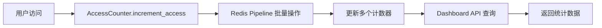
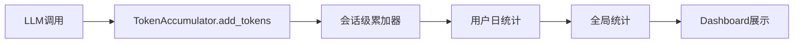

# Dashboard 数据存储架构指南

本文档详细梳理了 Loomi 智能看板系统中使用的 Redis Key 结构和数据库函数。

## 📊 概览

Dashboard 系统主要依赖以下数据源：
- **Redis**: 实时访问统计、Token消耗统计、连接池管理
- **PostgreSQL**: 用户数据、会话记录、AI分析结果
- **实时监控**: 端口健康检查、服务状态监控

---

## 🔑 Redis Key 结构详解

### 1. 访问统计相关 (AccessCounter)

#### 基础计数器
```redis
# 全局总访问次数
novachat:access:total
类型: String (Integer)
说明: 系统启动以来的总访问次数
TTL: 永久

# 每日访问次数
novachat:access:daily:{YYYY-MM-DD}
类型: String (Integer)  
示例: novachat:access:daily:2024-01-15
说明: 指定日期的访问次数统计
TTL: 86400秒 (1天)
```

#### 用户访问统计
```redis
# 用户总访问次数
novachat:access:user:{user_id}
类型: String (Integer)
示例: novachat:access:user:user_123456
说明: 单个用户的总访问次数
TTL: 604800秒 (7天)

# 每日用户访问次数
novachat:access:daily_user:{YYYY-MM-DD}:{user_id}
类型: String (Integer)
示例: novachat:access:daily_user:2024-01-15:user_123456
说明: 指定用户在指定日期的访问次数
TTL: 86400秒 (1天)
```

### 2. Token统计相关 (TokenAccumulator)

#### 会话级Token统计
```redis
# 会话Token累加器
token_accumulator:{user_id}:{session_id}
类型: Hash
示例: token_accumulator:user_123:session_abc
字段:
  - prompt_tokens: 输入Token数量
  - completion_tokens: 输出Token数量  
  - total_tokens: 总Token数量
  - llm_calls: LLM调用次数
  - created_at: 创建时间
  - last_updated: 最后更新时间
TTL: 会话结束后清理
```

#### 用户Token统计
```redis
# 用户每日Token统计
token_stats:user_daily:{user_id}:{YYYY-MM-DD}
类型: String (Integer)
示例: token_stats:user_daily:user_123:2024-01-15
说明: 用户在指定日期消耗的总Token数
TTL: 2592000秒 (30天)

# 用户详细统计信息
user_stats:detailed:{user_id}:{YYYY-MM-DD}
类型: Hash
示例: user_stats:detailed:user_123:2024-01-15
字段:
  - total_tokens: 总Token消耗
  - llm_calls: LLM调用次数
  - session_count: 会话数量
  - avg_tokens_per_session: 平均每会话Token消耗
TTL: 2592000秒 (30天)

# 用户会话集合
user_sessions:{user_id}:{YYYY-MM-DD}
类型: Set
示例: user_sessions:user_123:2024-01-15
说明: 用户在指定日期的所有会话ID集合
TTL: 2592000秒 (30天)
```

#### 全局Token统计
```redis
# 每日全局Token统计
token_stats:daily:{YYYY-MM-DD}
类型: String (Integer)
示例: token_stats:daily:2024-01-15
说明: 全系统在指定日期的Token消耗总量
TTL: 2592000秒 (30天)

# 每月全局Token统计  
token_stats:monthly:{YYYY-MM}
类型: String (Integer)
示例: token_stats:monthly:2024-01
说明: 全系统在指定月份的Token消耗总量
TTL: 7776000秒 (90天)
```

### 3. 连接池管理相关 (ConnectionPoolManager)

```redis
# 高优先级连接池统计
connection_pool:stats:high_priority
类型: Hash
字段:
  - total_connections: 总连接数
  - active_connections: 活跃连接数
  - idle_connections: 空闲连接数
  - failed_connections: 失败连接数
  - last_health_check: 最后健康检查时间

# 普通连接池统计
connection_pool:stats:normal
类型: Hash (字段同上)

# 后台连接池统计  
connection_pool:stats:background
类型: Hash (字段同上)
```

### 4. 停止状态管理相关

```redis
# 用户停止状态
loomi:stop:{user_id}
类型: String
说明: 用户请求停止当前操作的状态标记
TTL: 30秒 (优化后从300秒缩短)
```

---

## 🗄️ 数据库函数详解

### 1. 用户统计函数

#### 获取每日新增用户数量
```sql
FUNCTION get_daily_new_users_count(target_date TEXT) RETURNS INTEGER

参数:
  - target_date: 目标日期，格式 'YYYY-MM-DD'

返回值:
  - INTEGER: 指定日期新注册的用户数量

实现逻辑:
  - 查询 auth.users 表
  - 筛选条件: created_at 在目标日期范围内
  - 排除条件: deleted_at IS NULL (排除已删除用户)

使用示例:
  SELECT get_daily_new_users_count('2024-01-15');
```

#### 获取用户留存数量
```sql
FUNCTION get_user_retention_count(target_date TEXT, days_back INTEGER DEFAULT 7) RETURNS INTEGER

参数:
  - target_date: 目标日期，格式 'YYYY-MM-DD'  
  - days_back: 回看天数，默认7天

返回值:
  - INTEGER: 符合留存条件的老用户数量

实现逻辑:
  - 查询 auth.users 表
  - 老用户条件: created_at < target_date (注册时间早于目标日期)
  - 活跃条件: last_sign_in_at >= (target_date - days_back天) 且 <= target_date
  - 排除条件: deleted_at IS NULL

使用示例:
  SELECT get_user_retention_count('2024-01-15', 7);  -- 7天内活跃的老用户
```

### 2. 权限设置

```sql
-- 授权给服务角色
GRANT EXECUTE ON FUNCTION get_daily_new_users_count(TEXT) TO service_role;
GRANT EXECUTE ON FUNCTION get_user_retention_count(TEXT, INTEGER) TO service_role;
```

---

## 🏗️ 数据库表结构

### 1. 用户认证表 (Supabase 内置)

```sql
-- auth.users (Supabase 系统表)
TABLE auth.users (
  id UUID PRIMARY KEY,                    -- 用户唯一ID
  email VARCHAR UNIQUE,                   -- 用户邮箱
  created_at TIMESTAMPTZ,                 -- 注册时间
  updated_at TIMESTAMPTZ,                 -- 更新时间  
  last_sign_in_at TIMESTAMPTZ,           -- 最后登录时间
  email_confirmed_at TIMESTAMPTZ,         -- 邮箱确认时间
  deleted_at TIMESTAMPTZ,                 -- 删除时间
  -- 其他 Supabase 系统字段...
)
```

### 2. 上下文存储表

```sql
-- public.contexts (用户上下文存储)
TABLE public.contexts (
  id UUID PRIMARY KEY DEFAULT gen_random_uuid(),
  user_id TEXT NOT NULL,                  -- 用户ID
  session_id TEXT NOT NULL,               -- 会话ID
  context_data JSONB NOT NULL DEFAULT '{}', -- 上下文数据
  created_at TIMESTAMPTZ DEFAULT now(),   -- 创建时间
  updated_at TIMESTAMPTZ DEFAULT now(),   -- 更新时间
  
  -- 索引
  INDEX idx_contexts_user_session (user_id, session_id),
  INDEX idx_contexts_user_id (user_id),
  INDEX idx_contexts_session_id (session_id)
)
```

### 3. AI分析结果表

```sql  
-- public.notes (AI生成的分析结果)
TABLE public.notes (
  id UUID PRIMARY KEY DEFAULT gen_random_uuid(),
  user_id TEXT NOT NULL,                  -- 用户ID
  session_id TEXT NOT NULL,               -- 会话ID
  action TEXT NOT NULL,                   -- Note类型 (profile、insight、hitpoint等)
  name TEXT NOT NULL,                     -- Note标识符 (profile1、insight5等)
  title TEXT NULL,                        -- Note标题
  context TEXT NOT NULL,                  -- Note完整内容
  select_status INTEGER DEFAULT 0,        -- 选择状态 (0=未选择，1=已选择)
  metadata JSONB DEFAULT '{}',            -- 扩展元数据
  created_at TIMESTAMPTZ DEFAULT now(),   -- 创建时间
  updated_at TIMESTAMPTZ DEFAULT now(),   -- 更新时间
  
  -- 约束
  CONSTRAINT notes_select_status_check CHECK (select_status IN (0, 1)),
  CONSTRAINT notes_user_session_name_unique UNIQUE (user_id, session_id, name),
  
  -- 索引
  INDEX idx_notes_user_session (user_id, session_id),
  INDEX idx_notes_action (action),
  INDEX idx_notes_user_id (user_id),
  INDEX idx_notes_session_id (session_id),
  INDEX idx_notes_name (name),
  INDEX idx_notes_select_status (select_status),
  INDEX idx_notes_created_at (created_at)
)
```

---

## 🔄 数据流转架构

### 1. 访问统计流程


### 2. Token统计流程  


### 3. 用户留存统计流程
```mermaid
graph LR
    A[Dashboard请求] --> B[/user-retention-stats API]
    B --> C[数据库函数查询]
    C --> D[auth.users表分析]  
    D --> E[返回留存数据]
```

---

## ⚡ 性能优化策略

### 1. Redis优化
- **连接池分层**: 高优先级(200连接)、普通(100连接)、后台(50连接)
- **批量操作**: 使用Pipeline减少网络往返
- **TTL策略**: 合理设置过期时间避免内存溢出
- **超时控制**: 所有操作都有超时保护

### 2. 数据库优化  
- **复合索引**: 针对查询模式创建组合索引
- **函数优化**: 使用数据库函数减少数据传输
- **RLS安全**: 行级安全确保数据隔离
- **JSONB索引**: 针对元数据字段创建GIN索引

### 3. 缓存策略
- **多层缓存**: Redis + 应用内存缓存
- **数据预热**: 系统启动时预热连接池
- **异步更新**: 统计数据异步更新不影响主流程
- **降级处理**: Redis不可用时优雅降级

---

## 🚀 监控与告警

### 1. Redis监控指标
- 连接池使用率
- 命令执行延迟  
- 内存使用情况
- Key过期清理

### 2. 数据库监控指标
- 查询执行时间
- 连接数使用率
- 索引命中率
- 慢查询日志

### 3. 业务监控指标
- 访问统计准确性
- Token计费准确性  
- 用户留存计算
- 端口健康状态

---

## 📝 维护说明

### 1. 定期清理
- Redis过期Key自动清理
- 数据库日志定期归档
- 统计数据定期备份

### 2. 扩容策略
- Redis集群化部署
- 数据库读写分离
- 连接池动态调整

### 3. 故障恢复
- Redis主从切换
- 数据库备份恢复  
- 统计数据重建

---

*最后更新时间: 2024年1月*
*维护团队: BluePlan Research*
